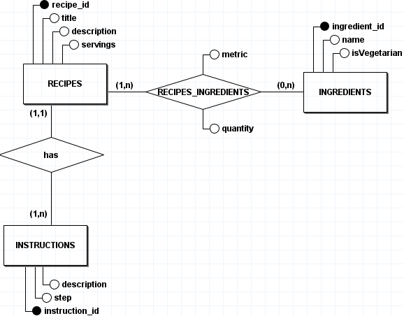
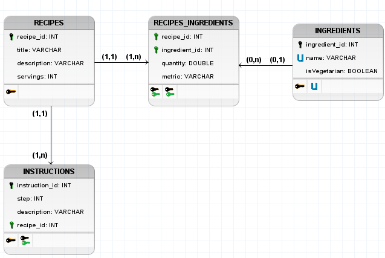
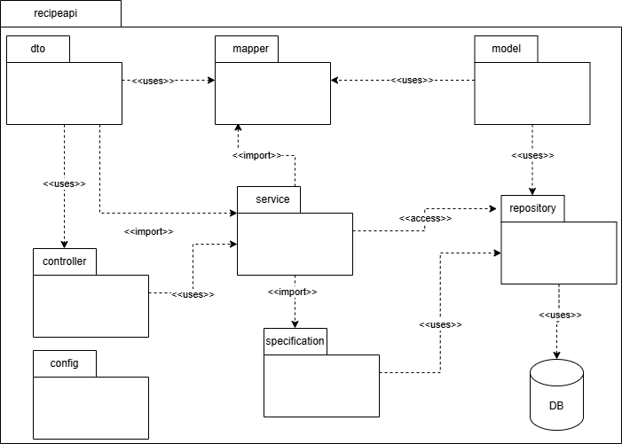

# ReciMe Coding Challenge - Lucas Pimentel Quintão

## How to run the Project

#### Prerequisites

- Java 17
- Maven
- PostgreSQL 14.17
- Docker (optional)

#### Setup Instructions

##### 1. Clone the repository

```bash
git clone git@github.com:LucasPimentel123/ReciMe-Coding-Challenge.git
cd recipeapi
```

##### With Docker

###### 2. Compile the project

```bash
./mvnw clean package
```

###### 3. Build the conteiners

```bash
docker-compose up --build
```

##### Without Docker

###### 2. Configure the database

- Create a PostgreSQL database named `recime_db`
- Update the `application.yml` or `application.properties` with your DB credentials (`postgres` are the default credentials)

###### 3. Run the application

```bash
./mvnw spring-boot:run
```

##### 4. Access API

```bash
http://localhost:8080
```

## API Documentation

This project uses Swagger UI to generate interactive API documentation.

Once the application is running, you can access the Swagger UI at:

```bash
http://localhost:8080/swagger-ui/index.html
```

#### Main Controller: RecipeController

The `RecipeController` is the core entry point of the API, responsible for managing recipes.

Using its endpoints, you can:

- Create recipes, either with new or already existing ingredients and instructions
- Retrieve recipes by id, or perform filtered searches using optional query parameters:
  - vegetarian
  - servings
  - included/excluded ingredients
  - instruction content search
- Update existing recipes (title, description, servings)
- Delete recipes

#### Auxiliary Controllers

Other controllers (such as `IngredientController`, `InstructionController`, `RecipesIngredientsController`) provide supporting endpoints to:

- Create, update, or delete individual ingredients, instructions and recipesIngredients (m:n relationship between Recipes and Ingredients)
- Allow flexibility when managing these entities separately from recipes

## Database

### Database Design

#### Entity Relationship Diagram

<p align="center">
  
</p>

##### Relationships

- A RECIPE has one or many INSTRUCTIONS, and an INSTRUCTION belongs to exactly one RECIPE (1:n)
- A RECIPE has one or many INGREDIENTS, and an INGREDIENT can belong to zero or many RECIPES (n:m)

#### Logical Data Diagram

<p align="center">
  
</p>

#### Assumptions and Decisions

- **Ingredients and Instructions as separate entities:**: To ensure better scalability, data organization, and query efficiency, both Ingredients and Instructions were modeled as independent entities, each with a dedicated relationship to the main `Recipe` entity.
- **isVegetarian as a INGREDIENT atribute:** To support the "vegetarian" filter required in the challenge, recipes need to be flagged accordingly. Instead of marking recipes directly, the isVegetarian flag was added to the Ingredient entity. A recipe is considered vegetarian only if all its ingredients are marked as vegetarian. This approach ensures consistency and better scalability.
- **Non-unique recipe titles**: The title field of the Recipe entity is not enforced as unique. This decision was based on how the ReciMe app works in practice — recipes are often imported from video/audio content on social media, where many users may submit similarly named recipes with different ingredients or preparation styles. Enforcing unique titles would limit usability and introduce unnecessary friction.
- **Unique constraint on Ingredient `name`:** To encourage data reuse and avoid unnecessary duplication in the database, the `name` atribute of the `Ingredient` entity is marked as unique.

### Database Seeding

To simplify local development and testing, the application includes automatic database seeding with initial data.

A `@Component` class (DatabaseSeeder) was included to seed data when the application context loads.

This seed inserts two sample recipes:

- Spaghetti alla Carbonara
- Cacio e Pepe

Each recipe includes a set of ingredients and detailed step-by-step instructions.

No additional steps are required — just run the application normally.

You can customize or disable this seeding logic by editing:

```bash
src/main/java/com/recime/recipeapi/config/DatabaseSeeder.java
```

## System Design

Given that this is a Spring Boot project, I followed the framework’s standard layered architecture.

<p align="center">
  
</p>

<p align="center">
Source: https://spring.io
</p>

#### Package Diagram

To better illustrate the modular structure of the project, the following Package Diagram shows the main packages and their responsibilities:

<p align="center">
  
</p>

**Package Responsibilities:**

- `controller` – Handles HTTP requests and maps them to service layer calls. Follows REST principles.

- `service` – Contains the business logic of the application, acting as a bridge between controllers and repositories.

- `repository` – Interfaces that interact with the database using Spring Data JPA.

- `model` – Domain entities that map to database tables (annotated with JPA/Hibernate).

- `dto` – Data Transfer Objects used to expose or receive data via API endpoints.

- `mapper` – Classes responsible for converting between entities and DTOs.

- `specification` – Contains dynamic query logic using Specification and CriteriaBuilder.

- `config` – Contains general project configurations (database seeding)

## Unit Tests

The project includes unit tests for the most relevant methods within the `Service` layer, the part of the application responsible for the core business logic.

#### Running the tests

To run all unit tests, use the following command from the project root:

```bash
cd recipeapi
./mvnw test
```

## AI Usage

As there was no restriction regarding the use of AI tools, I leveraged them as productivity boosters to deliver the most complete solution possible within the scope and time constraints of the challenge.

### AI Tools and Use Cases

##### ChatGPT (GPT-4o)

- Helped write and refine sections of the `README.md` to ensure clarity, cohesion. Also assisted in structuring the document to highlight key aspects of the project.
- Suggested approaches for database seeding.

##### Claude (Claude 3.5 Sonnet)

- Assisted in writing and structuring configuration files, including `application.yml` and `application-test.yml`.
- Guided the construction of dynamic queries using Spring Data JPA Specifications and `CriteriaBuilder`, including multi-join queries with conditional filters. (`RecipeSpecification`).
- Helped determine when to use `@DirtiesContext` to isolate tests and avoid side effects in database-related operations (Unique Key Constraint Errors).

##### Cursor

- Used autocomplete with `Tab` to accelerate writing of boilerplate code and to assist with generating simple logic or repetitive tasks directly in the editor.
